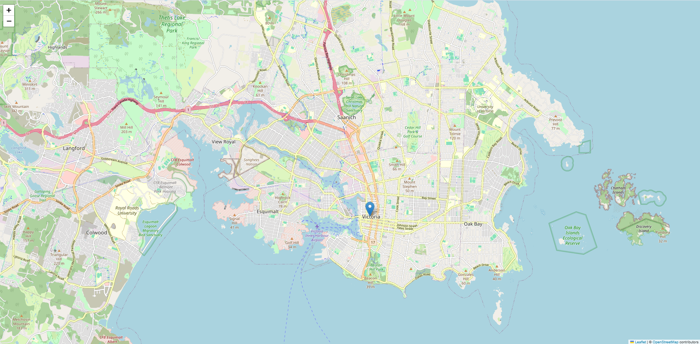

# 🛠️ Data Science Environment Setup Guide

This guide sets up a Python environment for working with, analyzing, and visualizing spatial data using PostgreSQL with PostGIS and Folium for interactive mapping.

---

## **1. Setup Environment**

### 🌀 Step 1.1: Clone the Repository
Start by cloning the project repository to your local machine:
```bash
git clone https://github.com/Mannerow/ds-env-setup.git
cd ds-env-setup
```

### 💻 Step 1.2: Create a Virtual Environment

Create a virtual environment using Python 3.12:

```bash
py -3.12 -m venv venv
```

### 🔑 Step 1.3: Activate the Virtual Environment

```bash
source venv/Scripts/activate
```

You’ll know the environment is active when your terminal prompt changes to something like:

```bash
(venv) user@machine ~/project
```

### 📦 Step 1.4: Upgrade pip

Upgrade pip to ensure you have the latest version:

python -m pip install --upgrade pip

### 🛠️ Step 1.5: Install Dependencies

Install all project dependencies listed in requirements.txt:

```bash
python -m pip install -r requirements.txt
```

## 2. Install PostgreSQL and PostGIS

### 🐘 Step 2.1: Install PostgreSQL

1. Download PostgreSQL from the official website: [PostgreSQL Downloads](https://www.postgresql.org/download/). 
2. Follow the installation instructions for your operating system:
    * During installation, ensure that you also install the **Stack Builder** tool.

### 🌍 Step 2.2: Enable and Verify PostGIS

1. Open the PostgreSQL client (pgAdmin).
2. Connect to your database and enable PostGIS:

```sql
CREATE EXTENSION postgis;
CREATE EXTENSION postgis_topology;
```

3. Verify postgis version:

```sql
SELECT postgis_full_version();
```

## 3. Connect to PostgreSQL from Python

### 📝 Step 3.1: Create a .env File

.env File Example:

```bash
DB_USER=your_username
DB_PASSWORD=your_password
DB_HOST=localhost
DB_PORT=5432
DB_NAME=your_database_name
```

### 🐍 Step 3.2: Run the Python Script

Run the script to test the database connection:

```bash
python pgconnect.py
```

If the connection is successful, you’ll see the output:

```
Connected to the database successfully!
SQLAlchemy engine created successfully!
```

## 4. Generate and Open the Folium Map

### 🐍 Step 4.1: Run the Python Script

```bash
python folium_map.py
```

The script will generate an HTML file named map.html in your project directory. You should see the following output:

```
Map has been saved to map.html
```

### 🌍 Step 4.2: Open the HTML File

Option 1: Double-click the map.html file.

